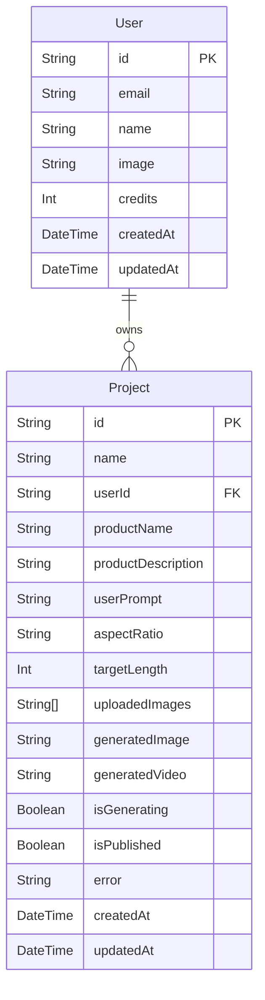

# Project Snapshot

CoreClip is an AI content generation app that lets authenticated users upload a product image and a model image, generate a stylized product/photo result using Google GenAI, and then optionally generate a short video from that image. The frontend is a React + Vite SPA using Clerk for auth; the backend is an Express server with Prisma/Postgres and Cloudinary storage. There is also a Clerk webhook handler that syncs Clerk user events into a local `User` table.

## 1. Project Snapshot

- One-paragraph factual description of what the app does, based only on code/README evidence
  CoreClip is an AI content generation app that lets authenticated users upload a product image and a model image, generate a stylized product/photo result using Google GenAI, and then optionally generate a short video from that image. The frontend is a React + Vite SPA using Clerk for auth; the backend is an Express server with Prisma/Postgres and Cloudinary storage. There is also a Clerk webhook handler that syncs Clerk user events into a local `User` table.
- Monorepo or separate frontend/backend repos? Folder layout (tree, 3-4 levels deep, excluding node_modules/.git/build/dist)
  - `client/`
    - `package.json`
    - `vite.config.ts`
    - `tsconfig.app.json`
    - `tsconfig.json`
    - `src/`
      - `App.tsx`
      - `main.tsx`
      - `components/`
      - `configs/`
      - `pages/`
      - `types/`
    - `public/`
  - `server/`
    - `package.json`
    - `server.ts`
    - `tsconfig.json`
    - `configs/`
    - `controllers/`
    - `middlewares/`
    - `routes/`
    - `types/`
    - `prisma/` - `schema.prisma` - `migrations/`
      Monorepo with separate frontend and backend folders.
- Package manager and Node version in use (from package.json/engines or lockfile)
  - `npm` inferred from `server/package-lock.json`
  - No explicit `engines` field in package manifests
  - Clerk packages in `server/package-lock.json` declare `node: ">=20.9.0"`

## 2. Tech Stack Inventory

Frontend dependencies:

- Framework: React `^19.2.0`
- Router: `react-router-dom` `^7.14.0`
- Auth/UI: `@clerk/react` `^6.5.0`, `@clerk/themes` `^2.4.57`
- HTTP client: `axios` `^1.16.1`
- Styling/UI: `tailwindcss` `^4.1.17`, `@tailwindcss/vite` `^4.1.17`
- Motion/animations: `framer-motion` `^12.23.26`
- Smooth scrolling: `lenis` `^1.3.16`
- Icons: `lucide-react` `^0.555.0`
- Toast notifications: `react-hot-toast` `^2.6.0`

Backend dependencies:

- Framework: Express `^5.2.1`
- Auth middleware: `@clerk/express` `^2.1.13`
- ORM/client: `@prisma/client` `^7.8.0`
- Prisma CLI: `prisma` `^7.8.0`
- Postgres adapter: `@prisma/adapter-pg` `^7.8.0`
- File upload: `multer` `^2.1.1`
- CORS: `cors` `^2.8.6`
- Env loader: `dotenv` `^17.4.2`
- HTTP client: `axios` `^1.16.1`
- Cloudinary SDK: `cloudinary` `^2.10.0`
- Google GenAI SDK: `@google/genai` `^2.5.0`
- Postgres driver: `pg` `^8.20.0`

Database:

- Prisma version: `7.8.0`
- Provider: `postgresql` from `server/prisma/schema.prisma`
- Adapter: `@prisma/adapter-pg`

Auth:

- Clerk frontend package: `@clerk/react`
- Clerk backend package: `@clerk/express`
- Clerk theming: `@clerk/themes`

AI/ML SDKs:

- `@google/genai` used for image generation and video generation in backend code

File/media storage SDK:

- `cloudinary` used for uploading images and videos

Payment SDK:

- None present; payment handling occurs via Clerk webhook data

Job queue / background processing:

- None present

Testing libraries:

- None present

## 3. Database Schema

```prisma
generator client {
  provider = "prisma-client"
  output   = "../generated/prisma"
}

datasource db {
  provider = "postgresql"
}

model User {
  id        String   @id
  email     String
  name      String
  image     String
  credits   Int      @default(20)
  createdAt DateTime @default(now())
  updatedAt DateTime @updatedAt

  // Relations
  projects Project[]
}

model Project {
  id                 String   @id @default(uuid())
  name               String
  userId             String
  productName        String
  productDescription String   @default("")
  userPrompt         String   @default("")
  aspectRatio        String   @default("9:16")
  targetLength       Int      @default(5)
  uploadedImages     String[]
  generatedImage     String   @default("")
  generatedVideo     String   @default("")
  isGenerating       Boolean  @default(false)
  isPublished        Boolean  @default(false)
  error              String   @default("")

  createdAt DateTime @default(now())
  updatedAt DateTime @updatedAt

  // Relations
  user User @relation(fields: [userId], references: [id], onDelete: Cascade)
}
```

Model purposes:

- `User`: stores Clerk-authenticated users synced into Prisma; contains contact info and credit balance.
- `Project`: stores AI generation jobs and results for a user; contains project metadata, uploaded source image URLs, generated asset URLs, status flags, and error details.

Relations:

- `User` has many `Project`
- `Project` belongs to `User` via `userId`
- Cascade delete rule: deleting a `User` also deletes their `Project` rows

Mermaid ER diagram:



Notable schema logic:

- `credits` defaults to `20` for new users.
- `Project.aspectRatio` defaults to `9:16`, and `targetLength` defaults to `5`.
- `uploadedImages` is a required array of strings, implying two uploaded image URLs are stored.
- `onDelete: Cascade` means removing a `User` removes associated `Project` records.

## 4. Authentication & Authorization Flow

Frontend:

- `client/src/main.tsx` wraps the app with `ClerkProvider` using `VITE_CLERK_PUBLISHABLE_KEY`.
- Uses Clerk hooks in components: `useUser`, `useAuth`, `useClerk`, and `UserButton`.
- Authenticated API calls attach `Authorization: Bearer ${token}` obtained from `getToken()`.
- Protected route navigation is handled at component level with Clerk state checks in `MyGenerations` and `Result`.

Backend:

- `server/server.ts` uses `clerkMiddleware()` after `express.json()`.
- `server/middlewares/auth.ts` exports `protect`, which checks `req.auth().userId`.
- All protected API routes under `/api/user` and `/api/project` use `protect`.

Clerk user sync flow:

1. Backend receives `POST /api/clerk` in `server/server.ts`.
2. Handler `server/controllers/clerk.ts` calls `verifyWebhook(req)`.
3. On `user.created`, it creates a Prisma `User` record.
4. On `user.updated`, it updates the Prisma `User` record.
5. On `user.deleted`, it deletes the Prisma `User` record.
6. On `paymentAttempt.updated` with a paid Clerk plan event, it increments `User.credits`.

Role/plan gating:

- No role-based ACL is implemented.
- Access control is based on Clerk auth only.
- Credit-based gating exists for image and video generation.
- Payment webhook increments credits for `pro` and `premium` plans.

## 5. API Surface

### User routes

| Method | Path                            | Auth required? | Purpose                                   | Key request/response       |
| ------ | ------------------------------- | -------------- | ----------------------------------------- | -------------------------- |
| GET    | `/api/user/credits`             | yes            | returns authenticated user credit balance | response `{ credits }`     |
| GET    | `/api/user/projects`            | yes            | returns all projects owned by user        | response `{ projects }`    |
| GET    | `/api/user/projects/:projectId` | yes            | returns one user-owned project            | response `{ project }`     |
| GET    | `/api/user/publish/:projectId`  | yes            | toggles project publish state             | response `{ isPublished }` |

### Project routes

| Method | Path                      | Auth required? | Purpose                                          | Key request/response                                      |
| ------ | ------------------------- | -------------- | ------------------------------------------------ | --------------------------------------------------------- |
| POST   | `/api/project/create`     | yes            | create project, upload images, generate AI image | request FormData; response `{ projectId }`                |
| POST   | `/api/project/video`      | yes            | generate video from existing project image       | request `{ projectId }`; response `{ message, videoUrl }` |
| GET    | `/api/project/published`  | yes            | list published projects                          | response `{ projects }`                                   |
| DELETE | `/api/project/:projectId` | yes            | delete a user-owned project                      | response `{ message }`                                    |

### Webhook routes

| Method | Path         | Auth required? | Purpose                                          | Key request/response   |
| ------ | ------------ | -------------- | ------------------------------------------------ | ---------------------- |
| POST   | `/api/clerk` | no             | Clerk webhook endpoint for user and payment sync | response `{ message }` |

## 6. Core Feature: AI Video Generation Pipeline

1. The user submits the form in `client/src/pages/Generator.tsx`.
   - Uploads product and model images.
   - Sends `FormData` to `POST /api/project/create`.
   - Includes Clerk auth bearer token in request header.

2. Backend receives request in `server/routes/projectRoutes.ts`.
   - `upload.array("images", 2)` saves two files via Multer.
   - `protect` middleware verifies Clerk auth via `req.auth().userId`.

3. `server/controllers/projectController.ts:createProject` checks credits.
   - Finds `User` by `userId`.
   - Requires at least `5` credits.
   - Deducts `5` credits immediately.

4. Uploaded images are pushed to Cloudinary.
   - Each file in `req.files` is uploaded with `resource_type: "image"`.
   - URLs become `uploadedImages`.

5. Create a `Project` record in Prisma.
   - `isGenerating` set to `true`.
   - Stores metadata and uploaded image URLs.

6. Generate the image using Google GenAI.
   - Model: `gemini-3-pro-image-preview`.
   - Sends two inline images and a text prompt.
   - Uses `ai.models.generateContent(...)` with `responseModalities: ["IMAGE"]`.

7. Parse image output.
   - Extracts base64 data from `response.candidates[0].content.parts`.
   - Uploads generated image bytes to Cloudinary.
   - Updates `Project.generatedImage` and sets `isGenerating: false`.

8. API returns `{ projectId }`.
   - On error, it updates `Project.isGenerating = false` and `Project.error`.
   - If credits were deducted, it refunds `5` credits.

9. Result page displays status in `client/src/pages/Result.tsx`.
   - Fetches `/api/user/projects/:projectId`.
   - Polls every 10 seconds while `project.isGenerating` is true.
   - Renders generated image or video URL.

10. Video generation is triggered by clicking `Generate Video`.
    - Frontend calls `/api/projects/video` with `{ projectId }`.
    - Note: backend route is actually `/api/project/video`, indicating a mismatch.

11. Backend `createVideo` checks credits.
    - Requires at least `10` credits.
    - Deducts `10` credits.
    - Ensures project exists, is not already generating, and no video exists.
    - Sets `isGenerating = true`.

12. Video generation via Google GenAI.
    - Model: `veo-3.1-generate-preview`.
    - Uses previously generated image URL downloaded as base64.
    - Calls `ai.models.generateVideos(...)`.
    - Polls with `ai.operations.getVideosOperation(...)` every 10 seconds until `operation.done`.

13. Final video upload and persistence.
    - Downloads generated video locally.
    - Uploads `.mp4` to Cloudinary with `resource_type: "video"`.
    - Updates `Project.generatedVideo` and sets `isGenerating: false`.
    - Deletes local temp file.

14. Final asset delivery.
    - Cloudinary secure URLs are stored in the `Project` record.
    - Frontend offers download links directly from these URLs.

## 7. Frontend Structure

Pages/routes:

- `/`: `Home` — landing page with hero, features, pricing, FAQ, CTA.
- `/generate`: `Generator` — form for uploading images and requesting AI generation.
- `/result/:projectId`: `Result` — shows generation results, status, downloads, and video trigger.
- `/my-generations`: `MyGenerations` — lists user-owned projects.
- `/community`: `Community` — lists published community projects.
- `/plans`: `Plans` — displays plan/pricing UI.
- `/loading`: `Loading` — temporary redirect/loading screen.

Major reusable components:

- `Navbar`: site navigation, login/signup, credit display, user menu.
- `ProjectCard`: generation preview card, status badges, publish/delete actions.
- `Pricing`: Clerk `PricingTable` embed.
- `UploadZone`: image upload UI.
- `Title`: section heading.
- `SoftBackdrop`, `Footer`, `Hero`, `Features`, `Faq`, `CTA`, `LenisScroll`.

State management:

- React local state with `useState`.
- No centralized state library or context beyond Clerk hooks.
- Auth state from Clerk (`useUser`, `useAuth`).

Notable UX patterns:

- Loading spinners for fetch states.
- Polling every 10 seconds for generation status.
- User redirect if unauthenticated from protected pages.
- Toast notifications for success/error.

## 8. Credits / Billing / Plan System

Usage metering:

- Image generation costs `5` credits.
- Video generation costs `10` credits.

Logic location:

- `server/controllers/projectController.ts` decrements credits and refunds on failure.
- `server/controllers/userController.ts:getUserCredits` exposes current credit balance.
- `server/controllers/clerk.ts` increments credits from Clerk payment events.

Billing details:

- No Stripe SDK present.
- Clerk webhook `paymentAttempt.updated` awards credits for paid `pro` or `premium` plan slugs.
- Credit increments are hardcoded: `pro` -> `80`, `premium` -> `240`.

## 9. Environment Variables

Database:

- `DATABASE_URL`

Auth / client config:

- `VITE_CLERK_PUBLISHABLE_KEY`
- `VITE_BASEURL`

AI Provider:

- `GOOGLE_CLOUD_API_KEY`

Server / misc:

- `PORT`
- `CLIENT_URL`

Notes:

- No `.env.example` file found in the repository.
- Env names were gathered from code references only.

## 10. Non-functional / Engineering Practices

Input validation:

- No validation library is used.
- Validation is manual in controllers and components.

Error handling:

- Controllers use `try/catch` blocks.
- No centralized Express error middleware is defined.
- Errors are returned as JSON with `message`.

Rate limiting / monitoring:

- None present.
- No logging framework beyond `console.log`.

Testing:

- No test files or testing dependencies detected.

Deployment config:

- No `Dockerfile`.
- No `vercel.json`, `render.yaml`, or GitHub Actions workflows found.

## 11. Notable Engineering Decisions Worth Highlighting Academically

- Webhook-based Clerk user sync: a backend webhook handler creates/updates/deletes Prisma `User` records from Clerk events.
- Inline polling for long-running AI video generation: `createVideo` waits inside the request handler rather than using background jobs.
- Credit deduction with refund logic: credits are decremented before generation and refunded on caught errors.
- Unified Cloudinary storage: input images, generated images, and generated videos are all uploaded to Cloudinary.
- `isGenerating` plus frontend polling: generation progress is tracked via database state and periodic polling.
- Middleware auth enforcement: Clerk middleware provides `req.auth()`, then `protect` middleware gates protected routes.

## 12. Open Questions / Gaps

- The frontend calls `/api/projects/video` but the backend route is `/api/project/video`.
- `Community.tsx` calls `/api/project/published` without Clerk auth headers, while the backend route is protected.
- No root README or `.env.example` file exists, so deployment/setup instructions are missing.
- The exact intended Node.js runtime is unclear due to no explicit `engines` field.
- `server/controllers/clerk.ts` contains duplicate `case "user.deleted"` blocks, suggesting a possible bug.
